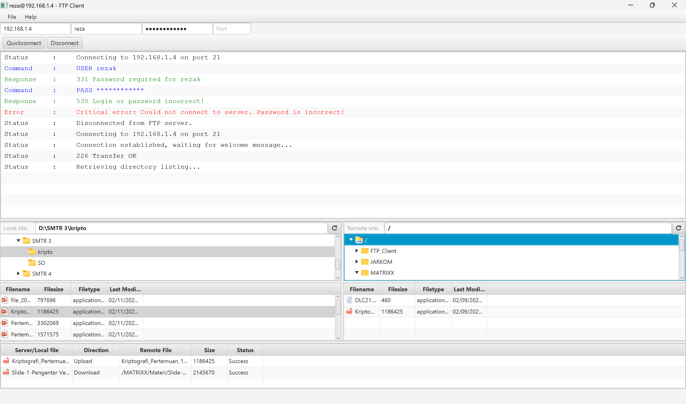

## FTP Client
Ini adalah program FTP Client berbasis dekstop yang dibuat menggunakan bahasa pemrograman Java. Program ini menggunakan library Apache Commons Net untuk mengimplementasikan protokol FTP dan untuk port saya set default ke 21. Program ini dapat melakukan beberapa operasi dasar seperti mengupload file, mendownload file, membuat direktori. Program ini juga dapat menampilkan daftar file dan direktori yang ada di server FTP. Aplikasi ini menggunakan library nio dan commons io untuk membantu dalam operasi input/output file.
Aplikasi ini dibuat menggunakan framework JavaFX untuk membuat tampilan GUI yang lebih interaktif.
## Fitur:
1. Mengupload file ke server FTP (double kilk pada file diTable View).
2. Mendownload file dari server FTP (double kilk pada file diTable View), otomatis mengambil path Download dari komputer anda untuk lokasi penyimpanan hasil download.
3. Membuat direktori baru diserver FTP dan dilokal komputer bagian Tree View. (Menampilkan dialog untuk memasukkan nama direktori).
4. Menampilkan daftar file (diTable View) dan daftar direktori (diTree View).
5. Menmapilkan log aktifitas pada bagian List View.
6. Menampilkan status download dan upload.
7. Tombol Refresh untuk me-refresh daftar file dan direktori diaplikasi.
8. Aplikasi ini juga otommatis mendaptakn informasi file serta meload ikon real dari file (menggunakan java swing).

